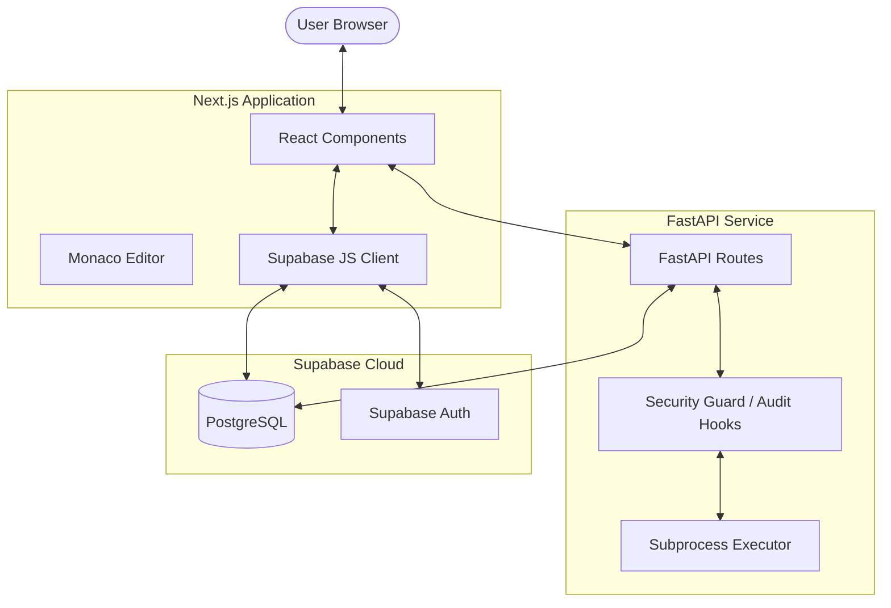

# DynoCode Architecture Documentation

This document provides a detailed overview of the DynoCode platform's architecture, features, and setup instructions.

## 1. Overview
DynoCode is a full-stack coding practice platform specifically designed for learning Python. It features a structured curriculum, real-time code execution with security guards, and automated test case validation.

## 2. Technology Stack

### Frontend
- **Framework**: Next.js (App Router)
- **Library**: React 19
- **Authentication**: Supabase Auth
- **Styling**: Vanilla CSS (Modern, premium aesthetics)
- **Editor**: Monaco Editor (`@monaco-editor/react`)
- **Animations**: `canvas-confetti`, `react-confetti`

### Backend
- **Framework**: FastAPI (Python)
- **Server**: Uvicorn
- **Execution Engine**: Subprocess-based Python executor with `sys.addaudithook` for security.
- **Database Client**: Supabase Python SDK

### Infrastructure & Database
- **Database**: Supabase (PostgreSQL)
- **Storage**: Supabase Storage (if applicable)
- **Deployment**: `deploy-backend.sh` (Shell script for backend deployment)

---

## 3. System Architecture Diagram

---

## 4. Core Features

### 4.1. Code Execution Engine
- **Sandboxed Execution**: Uses Python's `subprocess` to run user code.
- **Security Audit Hooks**: Implements `sys.addaudithook` to block dangerous system calls (e.g., `os.system`, `open`, `socket`).
- **Timeout Protection**: Limits code execution to 2 seconds to prevent infinite loops or resource exhaustion.

### 4.2. Problem Management
- **Structured Curriculum**: Problems are organized by modules and order.
- **Detailed Metadata**: Each problem includes descriptions, hints, concepts, starter code, and solutions.
- **Automated Testing**: Backend validates user code against multiple test cases, returning detailed feedback.

### 4.3. User Experience
- **Progress Tracking**: Streaks and dashboard to monitor learning progress.
- **Interactive Feedback**: Success modals with confetti animations upon passing all test cases.
- **Concept Lessons**: Educational content integrated directly into the coding interface.

---

## 5. How Things Work

### Code Submission Flow
1. **Writing Code**: The user writes Python code in the Monaco Editor on the frontend.
2. **Submission**: When clicking "Submit", the frontend sends the code and `problemId` to the backend's `/submit` endpoint.
3. **Fetching Test Cases**: The backend fetches the corresponding problem and its test cases from Supabase.
4. **Iterative Execution**: The backend runs the user's code for each test case input.
5. **Security Validation**: Every execution is wrapped in a security script that disables dangerous modules and sets up audit hooks.
6. **Result Compilation**: The backend compares the output with expected results and returns a JSON response.
7. **UI Update**: The frontend displays the results and triggers celebrations if all tests pass.

---

## 6. Setup and Installation

### Prerequisites
- Python 3.8+
- Node.js 18+
- Supabase Project

### Backend Setup
1. Navigate to the `backend` directory.
2. Create a virtual environment: `python -m venv venv`.
3. Activate venv: `source venv/bin/activate` (Mac/Linux) or `venv\Scripts\activate` (Windows).
4. Install dependencies: `pip install -r requirements.txt`.
5. Create a `.env` file with `SUPABASE_URL` and `SUPABASE_KEY`.
6. Run the server: `python main.py`.

### Frontend Setup
1. Navigate to the `frontend` directory.
2. Install dependencies: `npm install`.
3. Create a `.env.local` file with `NEXT_PUBLIC_SUPABASE_URL` and `NEXT_PUBLIC_SUPABASE_ANON_KEY`.
4. Run the development server: `npm run dev`.

---

## 7. Directory Structure
- `/frontend`: Next.js application, components, and global styles.
- `/backend`: FastAPI application and code execution logic.
- `deploy-backend.sh`: Automation script for deploying the backend service.
- `.venv`: Global virtual environment (optional).
